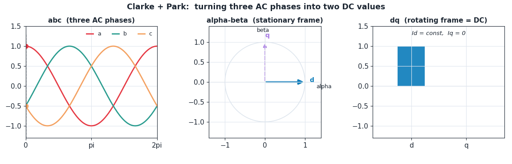
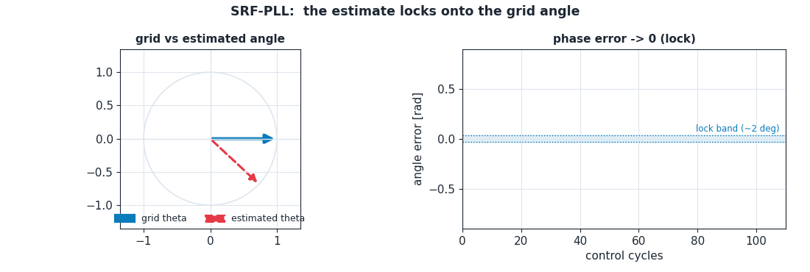
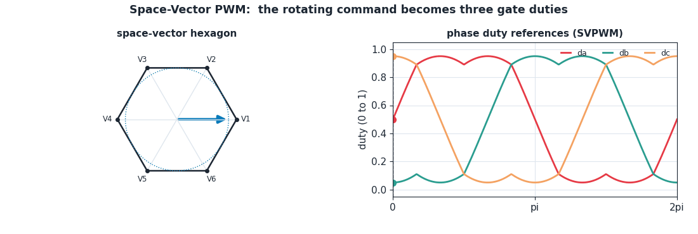
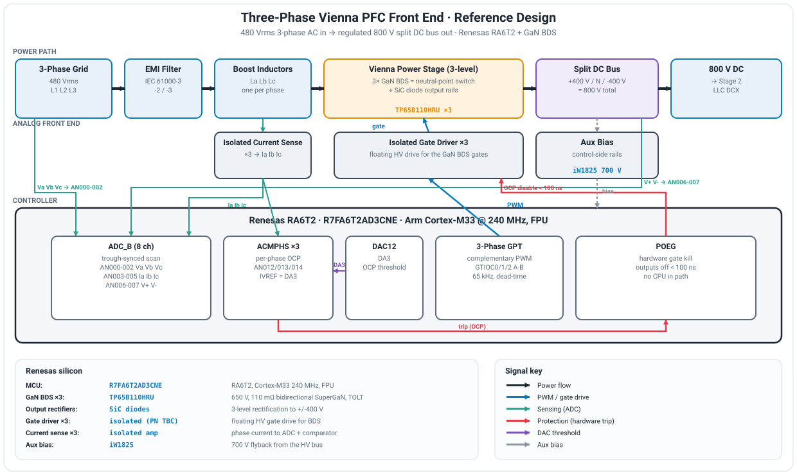
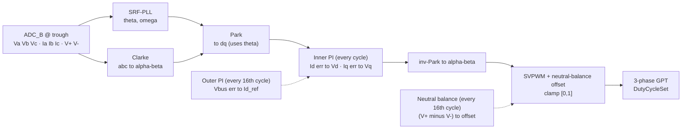
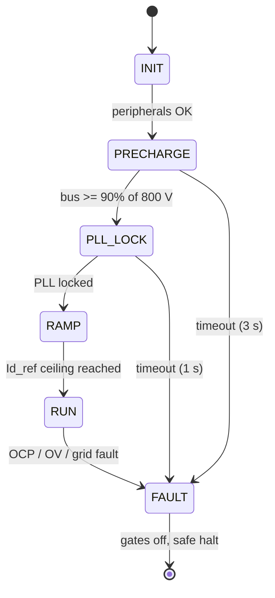

# Stage 1 - Three-Phase Vienna PFC Front End (`ra6t2-vienna-pfc-fw`)

**A closed-loop, three-phase, three-level Vienna rectifier that turns 480 V three-phase mains into a regulated 800 V split DC bus, with near-unity power factor. Firmware for the Renesas RA6T2, written from the topology up.**


> **Part of the [AI Datacenter PSU reference design](https://github.com/Naveens-Lab/renesas-ai-datacenter-psu), Stage 1 of 2.** This stage is the AC/DC front end of an 800 V datacenter power chain. Stage 2 is the [LLC DCX](https://github.com/Naveens-Lab/ra6t2-llc-dcx-fw) that steps the 800 V bus down to 48 V.

This README is written to be read top to bottom by someone who has never touched a PFC. It explains the concepts first, then justifies the silicon, then shows the hardware and the firmware. If you only want one thing, jump to the [reference design](#5-the-reference-design-the-hardware).

---

## Contents

1. [What this stage does](#1-what-this-stage-does)
2. [The concept, from zero](#2-the-concept-from-zero)
3. [The control idea: turning AC into a DC problem](#3-the-control-idea-turning-ac-into-a-dc-problem)
4. [Why GaN, and why the bidirectional switch](#4-why-gan-and-why-the-bidirectional-switch)
5. [The reference design (the hardware)](#5-the-reference-design-the-hardware)
6. [Control architecture (the closed loop)](#6-control-architecture-the-closed-loop)
7. [Firmware design](#7-firmware-design)
8. [Project structure](#8-project-structure)
9. [Build and bring-up](#9-build-and-bring-up)
10. [Status and roadmap](#10-status-and-roadmap)
11. [References](#references)

---

## 1. What this stage does

A datacenter sidecar rack takes in three-phase mains (480 Vrms line to line) and has to produce a clean, regulated 800 V DC bus for the downstream converters. Two things have to happen at once:

- **Rectify** the AC into DC and **regulate** that DC bus to 800 V.
- Do it while drawing **sinusoidal current in phase with the voltage**, so the rack looks like a clean resistive load to the grid (high power factor, low harmonic distortion). That second part is the *power factor correction* (PFC).

The topology that does this is a **three-phase, three-level Vienna rectifier**. "Vienna rectifier" is the circuit; "PFC" is one of the jobs it performs. In firmware this stage actually closes **three** control objectives simultaneously:

1. **Current shaping (PFC)** - force the input current sinusoidal and in phase.
2. **DC-bus regulation** - hold the total bus at 800 V.
3. **Neutral-point balancing** - keep the split bus centered (+400 V and -400 V around the midpoint).

That is the whole job. The rest of this document explains how.

---

## 2. The concept, from zero

### 2.1 What a PFC actually does

A plain diode rectifier draws current in short, ugly spikes near the AC voltage peaks. That is a terrible power factor and injects harmonics back into the grid. A PFC rectifier actively switches so that the current it draws is a clean sine wave, in phase with the voltage. The load then looks resistive to the grid. Regulatory limits (IEC 61000-3-2/-3) basically require this above a certain power.

### 2.2 Why three-level (Vienna)

The output bus is built from two capacitors in series: one makes +400 V, the other -400 V, with a **neutral point** in the middle. That is the "three-level" part (three voltage levels: +400, 0, -400). The payoff:

- Each switch only ever blocks about **half** the 800 V bus, so you can use lower-voltage, lower-loss devices.
- The voltage steps the inductor sees are smaller, so the current ripple and the THD are lower.

The cost is that the midpoint can drift, so the firmware has to actively balance it. That is the neutral-balancing loop.

---

## 3. The control idea: turning AC into a DC problem

This is the single most important concept in the firmware, so it gets its own section with animations.

### 3.1 Clarke and Park: abc to alpha-beta to dq

Controlling three time-varying AC phases directly is awkward. So we do two coordinate transforms:

- **Clarke transform** collapses the three phases (a, b, c) into two orthogonal axes (alpha, beta) on a fixed (stationary) frame.
- **Park transform** then rotates (alpha, beta) into a frame (d, q) that **spins with the grid**. In that rotating frame, a balanced AC quantity stops moving: it becomes a **DC value**.

That is the trick. Once the currents are DC in the dq frame, a simple PI controller can regulate them, exactly like a DC problem. In the dq frame:

- **Id** is the **active** (real-power) current.
- **Iq** is the **reactive** current. Hold **Iq = 0** and you get unity power factor.



*[Interactive version](https://naveens-lab.github.io/ra6t2-vienna-pfc-fw/clarke_park_dq.html): watch the three phase sinusoids collapse to a rotating alpha-beta vector, then freeze into DC values in the dq frame.*

### 3.2 The PLL: locking to the grid angle

The Park transform needs the grid angle **theta** at every instant, and theta has to be correct or the whole thing falls apart (a wrong angle smears the "DC" quantities back into AC and the loop is invalid). A **synchronous reference frame PLL (SRF-PLL)** estimates theta and the grid frequency omega by driving the q-axis of the grid voltage to zero. When the PLL is locked, theta tracks the grid exactly.



*[Interactive version](https://naveens-lab.github.io/ra6t2-vienna-pfc-fw/pll_lock.html): watch the estimated angle pull into alignment with the grid and the q-axis error settle to zero.*

This firmware's PLL starts at a 60 Hz estimate, clamps the frequency to a 45 to 65 Hz window as a runaway guard, and declares lock when the normalized angle error stays inside a band of about 2 degrees for roughly 15 ms.

### 3.3 SVPWM: turning the command back into gate pulses

After the control loops compute the voltage the converter should apply (in the dq frame), an inverse Park and inverse Clarke bring it back to the stationary frame, and **space-vector PWM (SVPWM)** turns that voltage vector into the three gate duty cycles. SVPWM uses the DC bus more efficiently than plain sine PWM and is the standard modulator for three-phase converters.



*[Interactive version](https://naveens-lab.github.io/ra6t2-vienna-pfc-fw/svpwm.html): watch the rotating reference vector sweep the space-vector hexagon and generate the three phase duties.*

---

## 4. Why GaN, and why the bidirectional switch

The neutral-point switch in each phase has to conduct in **both** directions (a four-quadrant switch). The classic way to build that is two back-to-back switches in series, which doubles the device count, the conduction loss, and the gate-drive complexity.

Renesas's **bidirectional GaN switch (BDS)** collapses that into a single monolithic device. In this topology that buys you:

- **One device per phase instead of two**, so lower conduction loss and far less board area.
- **Half the bus voltage to block** (three-level), squarely in the 650 V GaN sweet spot.
- **Only three floating HV drivers** for the whole rectifier.
- **High dv/dt (over 100 V/ns) and low gate charge**, which cuts switching loss and enables high power density.
- **No negative gate bias** with Renesas SuperGaN, so the gate driver stays simple.

GaN here is not a default. It is the reason the topology is attractive at 800 V, which is exactly why it sits at the center of the silicon choice.

### Silicon used

| Role | Part | Why |
|---|---|---|
| Control MCU | `R7FA6T2AD3CNE` (RA6T2) | Cortex-M33 @ 240 MHz with FPU; three-phase complementary GPT, cycle-synchronized ADC_B, ACMPHS comparators, POEG hardware fault path. Steps up to RA8T1 only if cycle-bound. |
| Neutral-point switch x3 | `TP65B110HRU` GaN BDS | 650 V, 110 mΩ bidirectional SuperGaN (TOLT). One device replaces two back-to-back switches per phase. |
| Output rectifiers | SiC diodes | low reverse-recovery rectification onto the +/-400 V rails. |
| Isolated gate driver x3 | Renesas isolated HV driver | floating high-side gate drive for the BDS *(exact PN from the Winning Combination BOM)*. |
| Isolated current sense x3 | Renesas isolated current-sense amp | per-phase inductor current to the ADC and the OCP comparator. |
| Aux bias | `iW1825` | 700 V flyback generating control-side bias from the HV bus. |

---

## 5. The reference design (the hardware)

The full connection diagram: power path, sensing chain, gate drive, and the split bus, with every Renesas part labeled.



The signal flow the firmware cares about:

- **Three boost inductors**, one per phase, feed the three BDS neutral-point switches and the SiC output rectifiers, building the +400 V / -400 V split bus.
- **Grid voltage sensing** (Va, Vb, Vc) feeds the PLL.
- **Inductor current sensing** (Ia, Ib, Ic) goes two places: to the ADC for the control loop (the cycle-synchronized average), and to the ACMPHS comparators for the hardware overcurrent trip.
- **Bus rail sensing** (V+, V-) feeds the voltage loop and the neutral-balance loop.
- **Three GaN gate-drive pairs** are driven by the three-phase complementary PWM.

---

## 6. Control architecture (the closed loop)

The control loop runs **once per PWM cycle (65 kHz)**, triggered by the ADC sampling at the carrier trough. The chain:



### Fast loop vs slow loops

This is the part worth understanding. Not everything runs at the same rate, because not everything moves at the same speed:

- **Inner current loops (fast, every 65 kHz cycle).** Inductor current changes quickly, so the d-axis and q-axis current PIs run every single cycle. The d-axis tracks `Id_ref`; the q-axis holds `Iq_ref = 0` for unity power factor. Their output is the dq voltage command.
- **Outer voltage loop (slow, every 16th cycle, about 4 kHz).** The 800 V bus moves slowly compared to the current, so regulating it every cycle is wasteful and can fight the inner loop. It runs on a divider, takes the bus-voltage error, and produces `Id_ref` (how much active current to draw). This is a classic cascaded structure: the outer loop commands the inner loop.
- **Neutral-balance loop (slow, every 16th cycle).** Measures `(V+) - (V-)` and injects a small common-mode duty offset to recenter the midpoint. Also slow, also on the divider.

Running the slow loops on a divider (`PFC_SLOW_LOOP_DIVIDER = 16`) times their integral action correctly and keeps the ISR budget free for the fast path.

### Startup state machine

The converter never just slams on. It walks a sequence, and any fault drops straight to a latched safe state:



- **PRECHARGE** soft-charges the bus through a current-limited path to survive inrush.
- **PLL_LOCK** waits for grid synchronization before any current is commanded.
- **RAMP** brings `Id_ref` up gently (soft-start) instead of stepping it.
- **RUN** is full closed-loop regulation.
- **FAULT** is latched: gates off, safe halt.

### Key control parameters

| Parameter | Value | Note |
|---|---|---|
| Carrier / control rate | 65 kHz | one control loop per PWM cycle |
| Slow-loop rate | 65 kHz / 16 (~4.06 kHz) | outer voltage + neutral balance |
| Bus voltage target | 800 V | total split bus |
| Reactive current ref `Iq_ref` | 0 | unity power factor |
| PLL nominal / clamp | 60 Hz / 45 to 65 Hz | pulls to true grid frequency |
| PLL damping / bandwidth | zeta 0.707 / 15 Hz | lock at ~2 deg error held ~15 ms |
| Pre-charge complete | 90% of 800 V | timeout 3 s to FAULT |
| PLL lock timeout | 1 s | to FAULT |
| Bus over-voltage trip | 880 V (1.10x) | software OVP |

> PI gains, sensing scale factors, the Id ramp rate, and the OCP threshold count are intentionally left as bench-calibration values (`TODO` in `pfc_config.h`). The loop structure, clamps, anti-windup, and sample timing are final; the gains are tuned on the bench against the real plant. The current-sense offset is auto-calibrated at boot from a 256-sample average.

---

## 7. Firmware design

### Peripherals (configured in FSP, used via the generated handles)

| Peripheral | Handle | Role |
|---|---|---|
| 3-phase GPT | `g_three_phase0` | complementary PWM on GPT0/1/2 (U/V/W), triangle-symmetric 65 kHz, 6-count (~50 ns) dead-time. Duties written together via `R_GPT_THREE_PHASE_DutyCycleSet`. |
| GPT0 trigger | `g_timer0` | fires the ADC at the carrier **trough**, which is the control-loop clock. |
| ADC_B | `g_adc_b` | 8-channel cycle-synchronized scan, GPT-triggered. Scan-complete ISR (`adc_b_callback`) **is** the control loop, highest priority. |
| Comparators x3 | `g_acmphs1/2/3` | per-phase hardware overcurrent. IVCMP = AN012/13/14, shared threshold IVREF = DA3, rising edge. |
| DAC12 | `g_dac0` (ch3 to DA3) | sets the shared OCP threshold voltage for the three comparators. |
| POEG | `g_poeg_a` | hardware kill: a comparator trip cuts all three GPT outputs in under 100 ns, no CPU in the path. Callback `poeg_a_callback`. |

### Interrupt priority map

| Source | Priority | Role |
|---|---|---|
| ADC scan-end (Group 0) | 0 (highest) | the control loop, never delayed |
| POEG event | 1 | OCP fault (hardware already cut the gates; the ISR latches and logs) |

The overcurrent path is fully hardware: comparator to POEG to gate-disable. The firmware priority of the trip is irrelevant to whether the gates turn off, which is the point.

### Why the ADC samples at the trough

Sampling the inductor current at the **center of the PWM period** captures the cycle **average** and rejects the switching ripple. A mid-point (trough-triggered) sample is what makes the current measurement clean enough to close a current loop on. This is mandatory for a PFC, not optional.

### Pin assignment

| MCU pin | Signal | Peripheral | Role |
|---|---|---|---|
| PB04 / PB05 | GTIOC0A / GTIOC0B | GPT0 (U) | U-phase BDS gate pair |
| PB06 / PB07 | GTIOC1A / GTIOC1B | GPT1 (V) | V-phase BDS gate pair |
| PA08 / PA09 | GTIOC2A / GTIOC2B | GPT2 (W) | W-phase BDS gate pair |
| PA00 | AN000 | ADC_B | Va grid voltage (to PLL) |
| PA01 | AN001 | ADC_B | Vb grid voltage |
| PA02 | AN002 | ADC_B | Vc grid voltage |
| PA03 | AN003 | ADC_B | Ia inductor current (to current loop) |
| PA04 | AN004 | ADC_B | Ib inductor current |
| PA05 | AN005 | ADC_B | Ic inductor current |
| PA06 | AN006 | ADC_B | V+ upper rail (voltage loop + balance) |
| PA07 | AN007 | ADC_B | V- lower rail |
| AN012 | IVCMP ch0 | `g_acmphs1` | Ia overcurrent input |
| AN013 | IVCMP ch1 | `g_acmphs2` | Ib overcurrent input |
| AN014 | IVCMP ch2 | `g_acmphs3` | Ic overcurrent input |
| (internal) | DA3 | DAC ch3 | shared OCP threshold to all three comparators |

The phase currents are sensed twice on purpose: AN003/4/5 feed the ADC for the control-loop measurement, and AN012/13/14 feed the comparators for the hardware trip. The ADC needs the average; the comparator needs the instantaneous trip. FSP does not let ADC_B and ACMPHS share one analog pin, so the isolated current-sense output fans out to two MCU pins.

---

## 8. Project structure

```
src/
├── hal_entry.c                 thin entry: pfc_app_init(); then run
└── app/
    ├── pfc_config.h            all tunables and constants (one source of truth)
    ├── pfc_types.h             shared types: abc, alpha-beta, dq, duty, measurements, state
    ├── pfc_safe.h              safe-state helpers
    ├── pfc_app.c / .h          supervisor: the startup state machine, mode gating
    ├── pfc_control.c / .h      the control ISR (the heart): assembles the full loop chain
    ├── pll.c / .h              SRF-PLL: grid angle and frequency
    ├── transforms.c / .h       Clarke / Park / inverse transforms
    ├── pi_controller.c / .h    generic PI with clamp and anti-windup
    ├── modulator.c / .h        SVPWM and duty generation
    ├── adc_manager.c / .h      ADC scan, calibration, counts-to-physical conversion
    └── protection.c / .h       DAC threshold, ACMPHS, POEG arm and fault handlers
```

The control ISR (`pfc_control_isr`) is deliberately the only place the loop is assembled, and it has no unbounded loops, no blocking calls, and single-precision math throughout, so its timing is deterministic.

---

## 9. Build and bring-up

**Toolchain:** Renesas e2 studio with FSP. Open the project, **Generate Project Content**, build.

**Staged bench bring-up** (never close the loop on a hot bus blind):

1. **Gates only, no power.** Verify the three complementary PWM pairs and the dead-time on a scope.
2. **Protection.** Confirm a comparator trip cuts all gates through POEG and latches FAULT.
3. **Sensing.** Inject known grid voltages and currents; verify the ADC scaling and especially the **current sign** (a flipped sign turns the current loop into positive feedback).
4. **PLL.** Confirm lock to the grid angle with the converter passive (IDLE mode, no current shaping).
5. **Closed loop at low power.** Enter RAMP, tune the inner current PIs, then the outer voltage PI, then the neutral balance, at reduced bus voltage first.

---

## 10. Status and roadmap

- [x] FSP peripheral configuration locked and verified (GPT, ADC_B, ACMPHS, DAC, POEG)
- [x] Full control firmware: PLL, transforms, dual-loop PI, neutral balance, SVPWM, state machine
- [x] Hardware overcurrent path (comparator to POEG)
- [ ] Bench: PI gain tuning against the real plant
- [ ] Bench: sensing scale factors and OCP threshold from the actual current-sense and shunt
- [ ] Bench: Id soft-start ramp rate
- [ ] Confirm Stage 1 gate-driver and current-sense part numbers from the Winning Combination BOM

---

## References

- Renesas, *Power Architecture Evolution in Data Centers* (white paper, October 2025):
  https://www.renesas.com/en/document/whp/power-architecture-evolution-data-centers
- Renesas, *3.6 kW Vienna Rectifier* reference design:
  https://www.renesas.com/en/applications/industrial/renewable-energy-grid/3-6kw-vienna-rectifier
- Hub repo (full system architecture):
  https://github.com/Naveens-Lab/renesas-ai-datacenter-psu
- Stage 2, LLC DCX:
  https://github.com/Naveens-Lab/ra6t2-llc-dcx-fw

---

*Built by [Naveens-Lab](https://github.com/Naveens-Lab). Firmware for the Renesas RA6T2, written from the topology up.*
